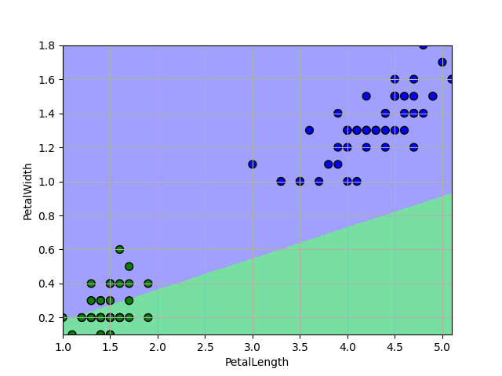
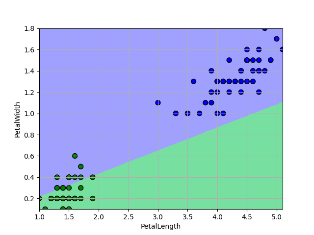

# Logistic-Regression
这是用于实现对数几率回归的代码，其中包含了模型的构建，在鸢尾花数据集上的测试，以及三种梯度下降算法的实现和比较。
# Environment
* python 3.8
* numpy 1.18.2
* matplotlib 3.3.3
* scikit-learn 0.23.2
# Model
根据对数几率回归的基本原理（包括Sigmoid函数、最大似然估计、梯度下降等）实现二分类模型。
# Dataset
sklearn内置的Iris数据集，选取了其中的两类鸢尾花和两种属性。
# Result
具体的参数和结果可以在代码中进行调整测试，课程论文中也进行了一部分的展示。
传统梯度下降算法下的分类可视化:

随机梯度下降算法下的分类可视化:

改进后随机梯度下降算法下的分类可视化:

# Reference Code
参考了[机器学习算法与Python实践之（七）逻辑回归（Logistic Regression）](https://blog.csdn.net/zouxy09/article/details/20319673)一文中的模型代码，并针对其中的具体实现作出了改进。
在可视化方面，参考了[机器学习——logistic回归，鸢尾花数据集预测，数据可视化](https://www.cnblogs.com/baby-lily/p/10639570.html)一文中颜色区分的可视化代码。
